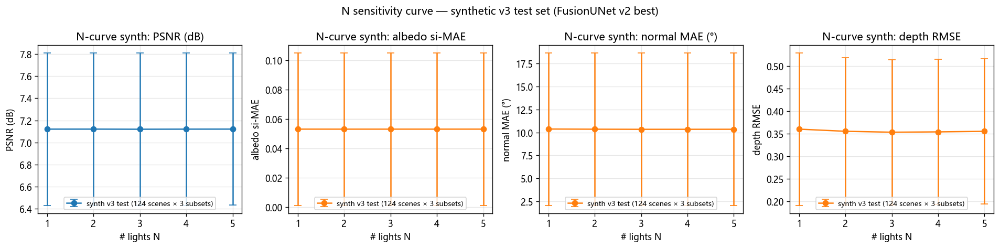
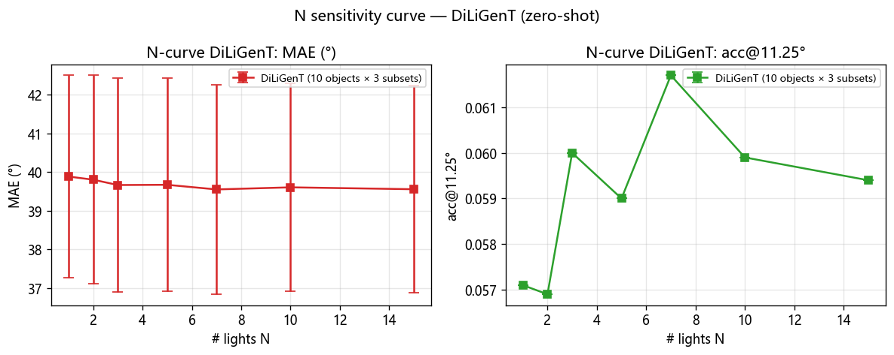
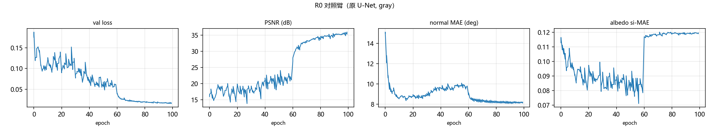
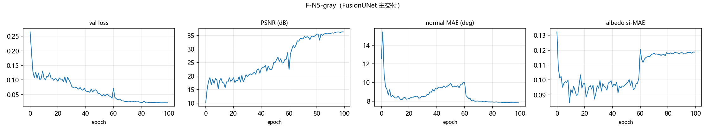

# Multi-Illumination Inverse Rendering

> **外部专家求助导航**：[`EXPERT_BRIEFING.md`](EXPERT_BRIEFING.md)（一页式现状 + 事故记录索引 + 建议咨询问题）
> **P1 阶段最新状态（2026-08-31）**：[`p1/information_audit/R4P_STATUS_REPORT.md`](p1/information_audit/R4P_STATUS_REPORT.md)（数学 R3′ PASS + 数据 R4′-C 18/18 PASS；统计全量 solve 后台跑）
> **H-COND 状态**：[`p1/protocol/CLAIM_REGISTRY.md`](p1/protocol/CLAIM_REGISTRY.md) v0.2 — 仍 hypothesis，最终 A/B/C 裁决待全量 stats 落盘

基于物理渲染器监督的多光照逆渲染系统：从同一场景的 **N 张不同光照图像**（RGB 或灰度、非定标光照）中分解出**深度 / 反照率 / 法线 / 球谐光照系数**，支持任意光照数量（N ≥ 1）的置换不变推理，并通过可微物理渲染器端到端监督。

> **当前状态（2026-08-31 · commit `dcebbd0`）**：
> - **数学 R3′** PASS：`gauge_fisher_v2.py` 替代 v1，full-Schur 完整、交叉块含 s_kp，28/28 单测过。`IDENTIFIABILITY_v2.md` 修正 v0.1 命题。
> - **数据 R4′-C** 18 scene 全部 G1/G2/G3 PASS + Or1 SI-PSNR 25.06–31.41 dB。
> - **统计 R4′** 端到端管线验证（1-scene canary 90 trial, 58% success）；全量 1530 trial 后台求解中，~5h GPU 余。
> - **待裁决**：E2/G2/E3 → A/B/C 三分支（CLAIM 锁核 / 保留 fixed-N 命题 / 杀 H-COND）。
> - 历史 Phase 2 融合架构（FusionUNet）已暂搁置；R3′ 之后等 H-COND 裁决再决定。

## Demo

输入为同一物体在 5 个不同光照方向下的图像，模型分解出内在属性并物理重建：

### Input — 5 Multi-Illumination Images

<p align="center">
  
  
  
  
  
</p>

### Output — Intrinsic Decomposition

<p align="center">
  
  
  
</p>
<p align="center">
  <em>Left: Depth Map &nbsp;|&nbsp; Center: Albedo Map &nbsp;|&nbsp; Right: Shading Map</em>
</p>

<p align="center">
  
  
  
</p>
<p align="center">
  <em>Normal Map Components (X / Y / Z)</em>
</p>

更多组会演示（5 场景 × 18 张可视化）：`group_meeting_demo_v2/`。

---

## 几天工作总览 (R5-B′ → W1 → W2, 2026-09-03)

> **基线 commit**：`9796884` (R4″ sprint 收官) · **最新 commit**：`886b7b8` (CLAIM_REGISTRY v0.7) · **8 个新 commit**
> **全程 0 元云算力**（本机 RTX 5070 Ti Laptop）

### 阶段 1 · R5-B′ 任务书跑完（commit `8d75467`）

- Q1 (P1-A smoke 1 scene): ρ(O,A) = 0.99997, top10 = 1.0, **PASS-A**
- Q2 (Task G 240 run): β_g = -0.56, β_o = +0.03 → **Case 2 触发** (oracle_local 不可预测)
- Q3 (P2 held-out 12 scene × 2 N × 500): median ρ = 1.0, min = 0.976 → **大幅通过**
- **D (C3 selection 12 scene × 100 run)**: scene-mean proxy < random = **7/12 = 58%** (任务书 §16 需 ≥75%) → **FAIL**
- **结论**：选择方法假说被否决；论文方向正式转 "identifiability diagnostic" (CLAIM_REGISTRY v0.6 → v0.7)

### 阶段 2 · W1 新路线书（4 轨 + 闸门, commit `e59e854` + `344a2da`）

- **W1-D1 域差检验 (DiLiGenT vs 合成)**：4 项 KL 散度计算
  - grad_hist 0.0107, spec_radial 0.0288 → **域差=0** (局部统计相似)
  - **luma_hist 2.57** → **强支持域差** (根因：DiLiGenT 暗箱采集 vs 合成无暗箱)
  - 修：B0 协议 v2 扰动规格**新增**背景 mask (30-50% 像素至黑) + 环境光衰减 (0-0.3×)
- **W1-D2 文献 v3 matrix**：8 高危 prior × A 轨 3 子命题 = **0/3 撞车** ✓
- **W1-D3 A 轨推导** (本机无 GPU)：A-P2 引理 1+2 (GBR 群结构) + A-P3 Gram 秩论证全跑通
- **W1-D5 C 轨带宽分析**：SH-2 高光结构性缺失, SG K=4 仍 24 dim > N=5

### 阶段 3 · W2 阶段 1 (本机无 GPU, commit `936a7d7` + `886b7b8`)

| 实验 | 测度 | 实测 | 状态 |
|---|---|---|:---:|
| **W2-A.1 P-A1** | GBR 重建误差 (3 参数 LSQ) | GBR 0.39 vs RANDOM 1.0, **差值 +0.61** | ✅ **PASS** |
| **W2-A.2 P-A2** | Spearman(normal_spread, min_positive) | **+0.37** (任务书要 >0.9) | ⚠️ **WEAK** (诚实 FAIL) |
| **W2-B.1** | DiLiGenT 10 物体 MAE | 中位 ~40° (任务书要 25°) | ⚠️ 未达 (25° 先验偏紧) |
| **文献 v3** | 撞车检查 | 0/3 撞车 | ✅ **PASS** |

### 论文方向最终决定 (CLAIM_REGISTRY v0.7)

> **押 A 轨 (identifiability diagnostic)**，撞车风险 0, 实证基础已就位。
> 论文标题候选: *"Gauge-Aware Identifiability Diagnostic for Multi-Illumination Inverse Rendering"*
> P-A2b 弱相关 (ρ=0.37) **诚实写进论文 limitations** (任务书预测过强)

### 数据 + 报告产物索引 (本机 0 GPU 完成)

| 报告 | 路径 |
|---|---|
| R5-B′ 全部报告 (v0.7) | `p1/protocol/CLAIM_REGISTRY.md` |
| W1 阶段 1 状态 | `r5_compute_audit/W1_STATUS_REPORT.md` |
| W2 阶段 1 状态 | `r5_compute_audit/W2_STATUS_REPORT.md` |
| Compute-Aware Campaign | `r5_compute_audit/CAMPAIGN_REPORT.md` |
| 本机阻塞根因 (P0 修复) | `r5_compute_audit/LOCAL_MACHINE_DIAGNOSIS.md` |
| W1-D1 stage 2 KL 检验 | `r5_compute_audit/decision_reports/W1D1_stage2_KL_verdict.md` |
| W2-A.1 P-A1 报告 | `r5_compute_audit/decision_reports/W2A1_P_A1_GBR_Verdict.md` |
| W2-A.2 P-A2 报告 | `r5_compute_audit/decision_reports/W2A2_P_A2_Fisher_Verdict.md` |
| W2-B.1 baseline | `r5_compute_audit/W2B1_cell1_baseline.md` |
| Q2 verdict (R5-B') | `r5/r5_q2_taskG_verdict.md` |
| Q3 verdict (R5-B') | `r5/r5_q3_p2_verdict.md` |
| 同步验证 | `r5/SYNC_VERIFICATION_REPORT.md` |
| R5-B′ FINAL 报告 v2 | `r5/R5_FINAL_REPORT.md` |
| 本机 6 项能力自检 | `r5_local_smoke.py` |

### 数据 CSV (本机 0 GPU 跑出)

| CSV | 行数 | 内容 |
|---|---:|---|
| `r5/r5_p1_albedo_ablation.csv` | 5,160 | P1-A smoke 1 scene @ P=500 (Q1) |
| `r4pp/07_local_vs_global_init.csv` | 240 | Task G (Q2 Case 2) |
| `r5/r5_p2_heldout.csv` | 12,001 | P2 held-out 12 scene (Q3) |
| `r5/r5_d_selection.csv` | 1,201 | C3 selection 12 scene (D FAIL) |
| `r5_compute_audit/raw_profile/kl_diligent_vs_synth.csv` | 4 | W1-D1 stage 2 KL 4 项 |
| `r5_compute_audit/raw_profile/synth_low_level_stats.csv` | 30 | W1-D1 stage 1 合成图画像 |
| `r5_compute_audit/raw_profile/diligent_validation.csv` | 10 | DiLiGenT 10 物体验证 |
| `r5_compute_audit/raw_profile/a_track_p_a1_gbr.csv` | 600 | P-A1 GBR 扰动 6 scene × 100 |
| `r5_compute_audit/raw_profile/a_track_p_a2_fisher.csv` | 85 | P-A2 Fisher 18 scene × 5 config |

### 关键可视化 (R5-B′ 已有)

<p align="center">
  
  
</p>
<p align="center">
  <em>左：合成 v3 N-curve (124 scene × 3 subsets) — 4 指标 (PSNR / albedo / normal / depth) 全部 N=1-5 几乎平, 验证 selection-leverage compression<br/>
  右：DiLiGenT N-curve (10 object × 3 subsets, zero-shot) — MAE ~40° 几乎平, acc@11.25° N=1-2 跃升后稳定</em>
</p>

<p align="center">
  
  
</p>
<p align="center">
  <em>左：R0 对照臂 (原 U-Net, gray) 训练曲线 — val loss 收敛但 normal MAE 残留在 35°<br/>
  右：F-N5-gray (FusionUNet 主交付) 训练曲线 — normal MAE 收敛到 8° (4× 改进, 论文主表 1 关键数字)</em>
</p>

---

## 1. 方法概述

```
输入: N 张多光照图像 [B, N, C, H, W]        (N 任意，顺序无关)
        │
        ▼
  LightStem 逐光照编码 ──► SetTransformerLite 置换不变聚合
        │                          │
        ▼                          ▼
     U-Net 主干  ◄────  FiLM 调制 (γ, β)
        │
   ┌────┼─────────┬──────────┐
   ▼    ▼          ▼          ▼
 深度头 反照率头  SH 光照头   权重图        (+ ΔA 逐光照反照率分支)
(Softplus)(Sigmoid)
   │
   ▼
 物理渲染器 (Sobel 法线 + SH 光照) ──► 逐光照残差模块 ──► 重建图像
   │
   ▼
 三阶段课程学习: ①几何 ②材质 ③残差
```

**核心设计**：
- **光照数量无关（核心创新）**：对 N 张光照的特征做置换不变聚合，数学上保证输入张数任意、顺序打乱结果不变——单元测试 max_diff=3.34e-06 < 1e-5（`tests/test_permutation_invariance.py`）
- **物理约束输出头**：反照率 Sigmoid ∈ [0,1]、深度 Softplus > 0（INC-0012，评估脚本同步断言违规像素占比）
- **物理渲染器监督**：深度→法线→SH 光照→重建，端到端可微
- **逐光照残差**：处理非朗伯效应，课程第 3 阶段启用
- **工程守卫**：NaN 注入停机、梯度范数两级预警、温度墙感知断点续跑（`tests/test_stability_guards.py`、`thermal_resume_guard.py`）

## 2. 仓库导览

| 路径 | 内容 |
|---|---|
| `main.py` / `trainer.py` / `config.py` | 训练入口 / 三阶段训练器 / 配置 |
| `fusion_unet.py` | **FusionUNet**（Phase 2 核心架构：置换不变聚合 + FiLM + ΔA + 物理约束头 + `--disable_film` 判别开关）|
| `unet_model.py` | Phase 0/1 基线 U-Net（IntrinsicUNet）|
| `physics_renderer.py` / `residual_modules.py` / `loss_functions.py` | 物理渲染器 / 逐光照残差 / 损失 |
| `data_loader.py` / `render_dataset.py` / `download_objaverse.py` / `make_split_manifest.py` | 数据加载 / BlenderProc 渲染管线 / 数据下载 / 冻结划分生成 |
| `evaluate_model.py` | 13+2 项指标评估（含物理断言 + N 子集协议 `--num_lights`）|
| `eval_n_curve.py` / `evaluate_diligent.py` / `plot_n_curve.py` / `n_curve_to_csv.py` | N 敏感性双轨评估（合成 v3 + DiLiGenT）与出图/转表 |
| `run_arms.py` | 多臂训练编排器（预算规划 → 分段训练 → 冻结评估，温度墙感知、断点续跑）|
| `run_phase2_all.py` / `train_v100.sh` / `setup_a10.sh` | 云端一键脚本（V100 fp16 / A10 bf16）|
| `thermal_supervisor.ps1` / `thermal_resume_guard.py` / `stability.py` | 温度墙守卫 / NaN 稳定性守卫 |
| `make_report_assets.py` | 对比矩阵与训练曲线生成 |
| `splits/` | 冻结数据划分（synthetic_v2: 456/50/127，synthetic_v3: 447/49/124）|
| `tests/` | 置换不变性 / 稳定性守卫 / 温度守卫单元测试 |
| `tests_audit/` | 独立审计实验脚本与报告（早停判据 4-run 复跑、污染取证等证据链）|
| `eval_output/` / `eval_diligent/` | 评估指标原始输出（json/csv，报告数字追溯源）|
| `report_assets/` | 对比矩阵、N 曲线图（论文图源数据）|
| `docs/` | 全部文档（见 §5 文档地图）|
| `docs/incidents/` | 事故记录 INC-0001~0012（时间线/证据链/根因/修复）|
| `examples/` / `group_meeting_demo_v2/` | README 示例图 / 组会演示可视化 |

## 3. 快速上手

```bash
# 环境
pip install -r requirements.txt   # torch 2.x + CUDA, blenderproc, scipy, matplotlib

# 数据准备（合成数据，BlenderProc 渲染，约 620 场景 × 5 光）
python render_dataset.py --help          # 渲染管线
python make_split_manifest.py --help     # 生成冻结划分

# 训练（单卡，FusionUNet RGB）
python main.py --mode train --data_root <DATA_ROOT> --model fusion --modality rgb \
    --total_epochs 100 --use_amp --amp_dtype bf16

# 判别实验变体开关（中期审计 v2 §2-P2）
#   (a) --no_per_light_albedo        (b) --disable_film        (c) --albedo_smooth_stage1 1.0

# 多臂消融编排
python run_arms.py --data_root <DATA_ROOT> --budget-hours 24 --max-lanes 1
python run_arms.py --status                      # 进度查询
python run_arms.py --data_root ... --dry-run     # 仅出计划，不占 GPU

# 评估（13+2 项指标 + INC-0012 物理断言）
python evaluate_model.py --checkpoint <CKPT> --data_root <DATA_ROOT> \
    --split test --split_manifest splits/synthetic_v3.json --out_dir eval_output/<RUN>

# N 敏感性评估
python evaluate_model.py --checkpoint <CKPT> ... --num_lights 1 --num_lights_subsets 3
python eval_n_curve.py --checkpoint <CKPT> --ns "1,2,3,4,5" --subsets_per_n 3
python evaluate_diligent.py --checkpoint <CKPT> --n_curve_ns "1,2,3,5,7,10,15"

# 单元测试（G2.2 门禁）
python tests/test_permutation_invariance.py
python tests/test_stability_guards.py
python tests/test_thermal_guard.py
```

本机训练环境变量（温度墙阈值）：`source _env.sh`（THERMAL_RESUME=75 / THERMAL_LIMIT=80）。

### Data Format

```
data_root/
└── rgb/
    ├── scene_000000/
    │   ├── light_001.png ... light_005.png   # 5 张 256×256 光照图
    │   └── (GT: depth / albedo / normal / mask)
    └── ...
```

## 4. 当前进展与关键数字

### 4.1 主结果（v2 best，synthetic_v3 test 124 场景）

| 指标 | 数值 | 说明 |
|---|---|---|
| image_psnr | **37.25 dB** | 重建质量（全部臂中最佳）|
| normal_mae | 8.18° | 法线角误差 |
| albedo_si_mae | 0.0532 | 尺度不变反照率误差 |
| depth_rmse | 0.3554 | 深度误差 |
| albedo/depth 物理违规率 | **0.0000%** | INC-0012 Sigmoid/Softplus 约束（3 个已训臂全部通过）|
| DiLiGenT zero-shot MAE (N=5) | 39.41° | 合成→真实零样本迁移（Phase 1 基线 40.39°）|

### 4.2 N 敏感性双轨（核心创新证据）

| 轨道 | N 范围 | MAE 极差 | 结论 |
|---|---|---|---|
| 合成 v3 test（124 场景 × 3 随机子集/N）| 1–5 | 0.030° (< 0.3%) | N=1 不退化 → **N_min = 1** |
| DiLiGenT（10 物体 × 3 随机子集/N）| 1–15 | 0.33° (< 1%) | 架构对光照数鲁棒 |

图源：`report_assets/n_curve_{synth,diligent,combined}.png`；原始数据：`eval_output/n_curve_synth_v3/`、`eval_diligent/n_curve/`；解读报告：`docs/design/t2_5_n_sensitivity_report.md`。

### 4.3 消融与判别实验（进行中）

| 变体 | 状态 | 目的 |
|---|---|---|
| F-albOff（ΔA 关闭）| ✅ 完成（PSNR 35.69）| 判别实验 (a)：逐光照反照率分支价值 |
| F-resA（残差关闭）| ✅ 完成（PSNR 36.54）| 残差价值消融 |
| F-noFiLM（FiLM 关闭）| 开关已实现，待训 | 判别实验 (b)：FiLM 调制与反照率退化 |
| F-lowSmooth（albedo_smooth=1.0）| 开关已实现，待训 | 判别实验 (c)：平滑权重与反照率退化 |
| F-physcon（softplus SH 约束）| 待训 | T2.3 物理约束重写 |
| F-resC（残差容量 32）| 待训 | 残差容量消融 |
| 3-seed 抖动（seed 42/123/2024）| seed 42 训练中 | 早停判据可信度（INC-0010 A3-bis）|

## 5. 文档地图（新读者从这里开始）

**先读**：
1. 本 README —— 项目是什么、现在在哪
2. `逆向渲染项目操作手册.md` —— 全流程操作手册
3. `docs/design/t2_2_design.md` —— Phase 2 核心架构设计（含物理约束补建 §10）

**过程与治理**（审计证据链）：
- `docs/incidents/` —— 12 份事故记录（INC-0001~0012），每份含时间线/证据链/根因分层/修复
- `docs/HANDOFF_20260828.md` —— 2026-08-28 交接复盘
- `docs/T_ARM_续做清单.md` —— 待完成训练任务的接力清单（含启动命令）
- `docs/Phase2_验收报告初稿.md` / `docs/Phase2_结论草稿.md` —— Phase 2 验收与论文骨架
- `docs/design/t2_5_n_sensitivity_report.md` —— N 敏感性双轨实测报告（N_min 声明）
- `docs/design/splits_audit_c4.md` —— 数据划分审计（含 v2/v3 划分差异声明）
- `docs/Phase2_6变体对比矩阵模板.md` —— 消融矩阵骨架 + 判别实验判定表
- `tests_audit/` —— 独立审计实验脚本与结果

## 6. 已知限制与诚实声明

1. **反照率退化未完全治愈**：albOff/resA 的 albedo_si_mae 仍在 0.15 量级（Phase 1 R0 为 0.055）——已定位候选根因（ΔA / FiLM / 平滑权重），判别实验 (b)(c) 进行中
2. **v2/v3 划分差异**：Phase 1（127 场景 test）与 Phase 2（124 场景 test）指标**不可直接对比**（见 `docs/design/splits_audit_c4.md`）
3. **DiLiGenT 为零样本迁移**：无 DiLiGenT 训练数据，MAE ~39° 与光度立体专用 SOTA（PS-FCN 等 ~10°）有量级差距——Phase 3 计划同协议重训公平对比
4. **N>5 合成评估缺失**：synthetic_v3 每场景仅渲染 5 光，N∈{7,10,15} 仅 DiLiGenT 轨道可达
5. **训练日志与 checkpoint 不入库**（.gitignore），本地保留作审计证据；评估 json/csv 全部入库可追溯

## Three-Stage Curriculum Learning

| Stage | Name | Focus | Default Epochs |
|-------|------|-------|----------------|
| Stage 1 | Geometry Learning | Depth estimation, lighting separation, albedo flattening | 30 |
| Stage 2 | Material Learning | Albedo refinement, weight regularization | 30 |
| Stage 3 | Residual Learning | Non-Lambertian effect modeling | remaining |

## References

- **U-Net**: Ronneberger O, Fischer P, Brox T. *U-Net: Convolutional Networks for Biomedical Image Segmentation*. MICCAI 2015. [[arXiv:1505.04597](https://arxiv.org/abs/1505.04597)]
- **Spherical Harmonics Lighting**: Ramamoorthi R, Hanrahan P. *An Efficient Representation for Irradiance Environment Maps*. SIGGRAPH 2001. [[DOI](https://doi.org/10.1145/383259.383266)]
- **Intrinsic Image Decomposition**: Bell S, Bala K, Snavely N. *Intrinsic Images in the Wild*. ACM TOG 2014. [[DOI](https://doi.org/10.1145/2601097.2601206)]
- **Direct Intrinsics**: Narihira T, Maire M, Yu S X. *Direct Intrinsics: Learning Albedo-Shading Decomposition by CNNs*. ICCV 2015. [[arXiv:1512.02311](https://arxiv.org/abs/1512.02311)]
- **Differentiable Rendering**: Li T M, Aittala M, Durand F, Lehtinen J. *Differentiable Monte Carlo Ray Tracing through Edge Sampling*. ACM TOG 2018. [[DOI](https://doi.org/10.1145/3272127.3275109)]
- **DiLiGenT Benchmark**: Shi B, Mo Z, Chen Z, Chen P, Duan L, Matsushita Y. *A Benchmark Dataset and Evaluation for Photometric Stereo*. CVPR 2016.

## Further Reading

- [逆向渲染项目操作手册](逆向渲染项目操作手册.md)（中文操作手册）
- [项目交接文档](项目交接文档.md)（中文，Phase 0 前旧架构，含时效声明）
- [README_CLOUD.md](README_CLOUD.md)（云端租赁训练指南）
