# Multi-Illumination Inverse Rendering System

A deep learning-based inverse rendering system that recovers depth maps, albedo maps, normal maps, and spherical harmonic lighting coefficients from multi-illumination grayscale images.

## Demo

The following results show model inference on a test scene. The input consists of 5 grayscale images of the same object under different lighting directions. The model decomposes them into intrinsic properties and reconstructs the rendered images.

### Input — 5 Multi-Illumination Images

<p align="center">
  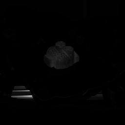
  
  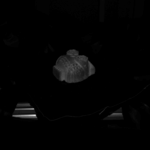
  
  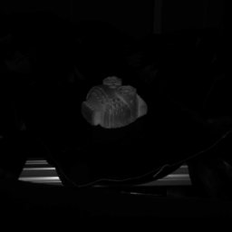
</p>

### Output — Intrinsic Decomposition

<p align="center">
  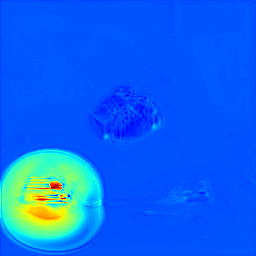
  
  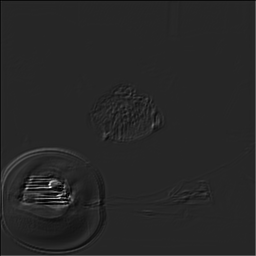
</p>
<p align="center">
  <em>Left: Depth Map &nbsp;|&nbsp; Center: Albedo Map &nbsp;|&nbsp; Right: Shading Map</em>
</p>

<p align="center">
  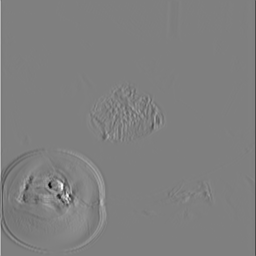
  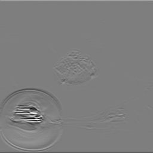
  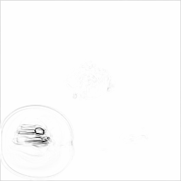
</p>
<p align="center">
  <em>Normal Map Components (X / Y / Z)</em>
</p>

### Output — Physically-Based Reconstruction

<p align="center">
  
  
  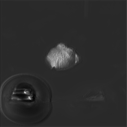
  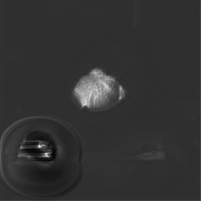
  
</p>
<p align="center">
  <em>Physically-based rendered images from predicted depth, albedo, and SH coefficients</em>
</p>

### Output — Residual Correction

<p align="center">
  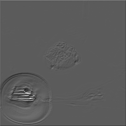
  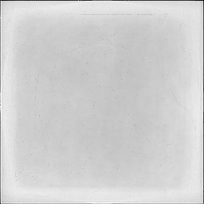
  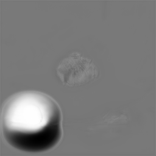
</p>
<p align="center">
  <em>Left: Global Residual &nbsp;|&nbsp; Center: Local Residual &nbsp;|&nbsp; Right: Adaptive Weight Map</em>
</p>

## Key Features

- Intrinsic decomposition from 5 multi-illumination grayscale images
- Multi-head U-Net architecture predicting depth, albedo, SH coefficients, and weight maps
- Differentiable physics-based renderer (depth → normals → SH lighting → rendered image)
- Hierarchical residual modules for non-Lambertian reflectance
- Three-stage curriculum learning (geometry → material → residual)

## Project Structure

| File | Description |
|------|-------------|
| [main.py](main.py) | Entry point — training, testing, and demo modes |
| [config.py](config.py) | Configuration management |
| [unet_model.py](unet_model.py) | U-Net model definition |
| [physics_renderer.py](physics_renderer.py) | Differentiable physics-based renderer |
| [residual_modules.py](residual_modules.py) | Hierarchical residual modules |
| [loss_functions.py](loss_functions.py) | Loss function collection |
| [trainer.py](trainer.py) | Three-stage curriculum learning trainer |
| [data_loader.py](data_loader.py) | Multi-illumination data loader |
| [inference.py](inference.py) | Inference script |
| [auto_training_monitor.py](auto_training_monitor.py) | Training health monitor |
| [model_diagnostics.py](model_diagnostics.py) | Model diagnostics and visualization |
| [dataset_test.py](dataset_test.py) | Dataset quality checker |
| [examples/](examples/) | Model inference examples |
| [逆向渲染项目操作手册.md](逆向渲染项目操作手册.md) | Operations manual (Chinese) |
| [项目交接文档.md](项目交接文档.md) | Handover document (Chinese) |

## Requirements

- Python 3.8+
- PyTorch 1.8+ (CUDA)
- torchvision, numpy, Pillow, tqdm
- matplotlib (optional, for visualization)

## Quick Start

### Training

```bash
python main.py --mode train
```

Set `data_root` in `main.py` to point to your dataset directory.

### Inference

```bash
python inference.py
```

Edit `checkpoint_path` and `image_folder` in `inference.py`.

### Data Format

```
data_root/
└── rgb/
    ├── scene_000000/
    │   ├── light_001.png
    │   ├── light_002.png
    │   ├── light_003.png
    │   ├── light_004.png
    │   └── light_005.png
    └── ...
```

Each scene contains 5 grayscale illumination images at 256×256 resolution.

## Model Architecture

```
Input: 5 multi-illumination grayscale images [B, 5, H, W]
  ↓
[IntrinsicUNet] → depth [B,1,H,W] + albedo [B,1,H,W] + SH coeffs [B,5,9] + weight [B,1,H,W]
  ↓
[PhysicsRenderer] → depth→normals (Sobel) → SH lighting → rendered image
  ↓
[HierarchicalResidual] → non-Lambertian correction
  ↓
Output: decomposed intrinsic properties + reconstructed images
```

## Three-Stage Curriculum Learning

| Stage | Name | Focus | Default Epochs |
|-------|------|-------|----------------|
| Stage 1 | Geometry Learning | Depth estimation, lighting separation, albedo flattening | 30 |
| Stage 2 | Material Learning | Albedo refinement, weight regularization | 30 |
| Stage 3 | Residual Learning | Non-Lambertian effect modeling | remaining |

## References

- **U-Net**: Ronneberger O, Fischer P, Brox T. *U-Net: Convolutional Networks for Biomedical Image Segmentation*. MICCAI 2015. [[arXiv:1505.04597](https://arxiv.org/abs/1505.04597)]
- **Spherical Harmonics Lighting**: Ramamoorthi R, Hanrahan P. *An Efficient Representation for Irradiance Environment Maps*. SIGGRAPH 2001. [[DOI](https://doi.org/10.1145/383259.383266)]
- **Intrinsic Image Decomposition**: Bell S, Bala K, Snavely N. *Intrinsic Images in the Wild*. ACM TOG 2014. [[DOI](https://doi.org/10.1145/2601097.2601206)]
- **Direct Intrinsics**: Narihira T, Maire M, Yu S X. *Direct Intrinsics: Learning Albedo-Shading Decomposition by CNNs*. ICCV 2015. [[arXiv:1512.02311](https://arxiv.org/abs/1512.02311)]
- **Differentiable Rendering**: Li T M, Aittala M, Durand F, Lehtinen J. *Differentiable Monte Carlo Ray Tracing through Edge Sampling*. ACM TOG 2018. [[DOI](https://doi.org/10.1145/3272127.3275109)]

## Further Reading

- [Operations Manual](逆向渲染项目操作手册.md) (Chinese)
- [Handover Document](项目交接文档.md) (Chinese)